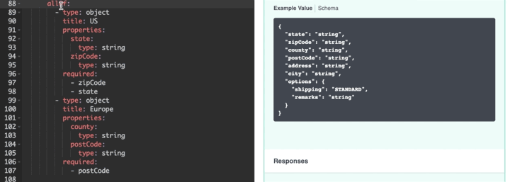

# swagger-ui-plugins

## OneOfPlugin

This plugin allows you to display OneOf- or AnyOf- structures in the **Example Value** preview that would otherwise not be displayed. Applies only to OAS3 Schemas and in non-executing mode.



### Issues

- **Example Value** is provided by a Swagger-UI method, which can return non up-to-date cached data.

### Example Configuration

``` javascript
// load standalone java script
<script src="./swagger-ui-plugins.min.js"></script>

<script>
    window.onload = function() {
        const OneOfPlugin = window.swaggerUI.plugins.OneOfExamplePlugin;
        const regexContentType = /(application\/)[a-z-+]*(json)/;
        const editor = SwaggerEditorBundle({
        dom_id: '#swagger-editor',
        showExtensions: true,
        url: './one-of-delivery-addresses.yaml',
        presets: [
            OneOfPlugin(regexContentType)
        ]
        });
        window.editor = editor
   }
</script>
```

## Schema Plugin

## Example Cleanup Plugin
